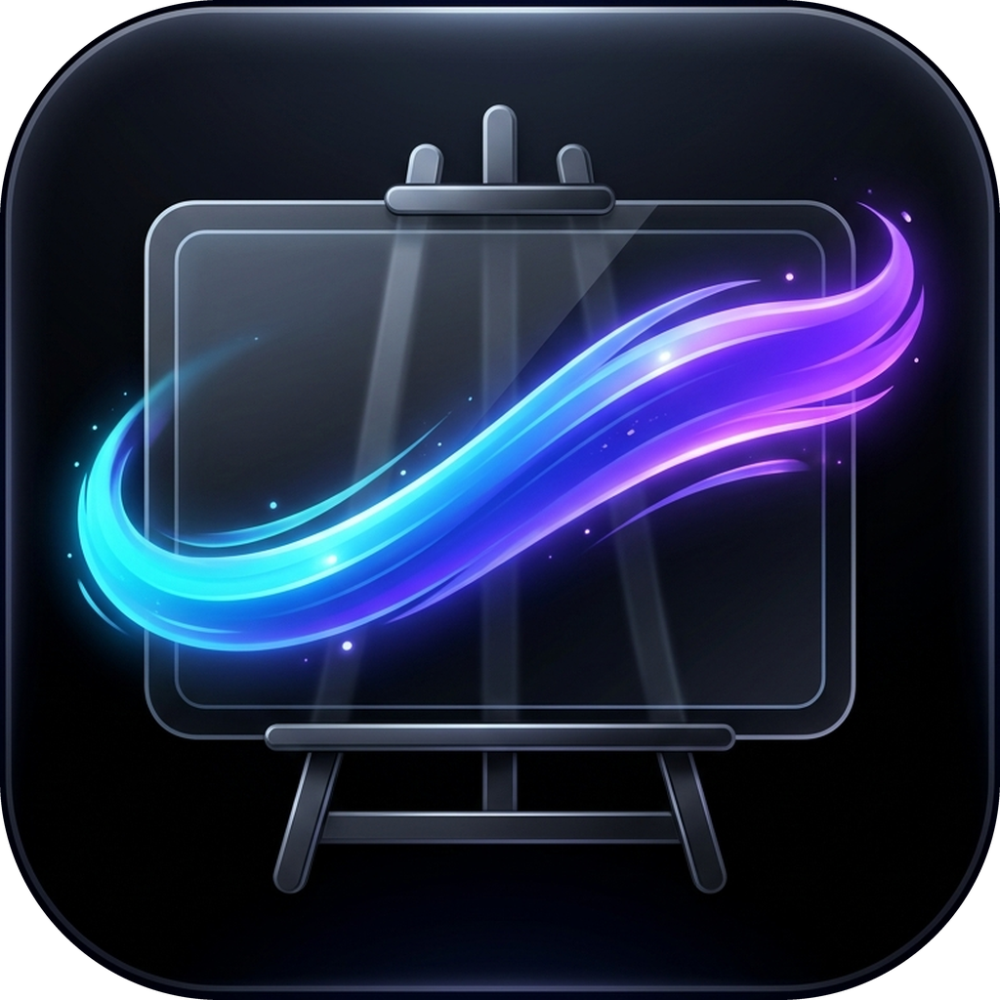

# Desktop Canvas 🎨

<p align="center">
  
</p>

<p align="center">
  <strong>Your interactive desktop whiteboard & note scratchpad for Windows</strong><br>
  A lightweight app designed for students to take notes, work through problems, and sketch ideas directly on their screen.
</p>

<p align="center">
  
  
  
</p>

---

## What is Desktop Canvas?

**Desktop Canvas** turns your computer screen into an instant scratchpad. Whenever you're watching online lectures, studying textbooks, or doing practice problems, you don't need to open bulky drawing apps or look away from your screen.

With one quick shortcut, you can draw over whatever you're working on. When you're done, switch back to desktop mode: your notes stay neatly pinned to your desktop wallpaper in the background so you never lose them, while your mouse clicks right through to your normal apps!

---

## 🌟 Student-Friendly Features

- ✏️ **Smooth Pen & Highlighter**:
  - Draw natural math formulas, underline text, and sketch physics diagrams.
  - Supports digital stylus pens with automatic eraser tip detection.
  - Remembers your favorite colors and thicknesses for pen and highlighter separately.
- 📝 **Sticky Notes**:
  - Double-click anywhere to drop a colorful sticky note.
  - Great for formula reminders, daily study to-do lists, and lecture summaries.
  - Move, resize, and style them with multiple pastel colors.
- 🖼️ **Paste Lecture Slides & Diagrams**:
  - Take a screenshot of a diagram or textbook problem and press `Ctrl + V` to paste it right onto your canvas.
  - Drag and drop images directly from your folders.
  - Move, scale, and rotate images with clean on-screen handles.
- 🖥️ **Live Wallpaper Mode**:
  - Hit `Ctrl + Alt + D` or `F8` to minimize the drawing tools and bake your notes into your desktop wallpaper.
  - Fully click-through: you can click all your regular desktop icons, open your browser, and write code while your notes stay visible in the background.
- 🎨 **Customizable Canvas Backgrounds**:
  - Pick clean dark gradients, subtle dot grids, or your own favorite study wallpapers.

---

## ⌨️ Helpful Shortcuts

| Shortcut | What It Does |
| :--- | :--- |
| **`Ctrl + Alt + D`** or **`F8`** | Toggle between Drawing Mode and Desktop Wallpaper Mode |
| **Double Click Canvas** | Create a new Sticky Note where you clicked |
| **`Ctrl + V`** | Paste an image or screenshot from your clipboard |
| **`Ctrl + Z`** / **`Ctrl + Y`** | Undo / Redo your strokes |
| **`Delete`** | Remove selected note, image, or ink stroke |
| **`Escape`** | Deselect active tool / Exit back to desktop |

---

## 🚀 How to Run It Locally

### Prerequisites
- **Windows 10 or 11**
- [Node.js](https://nodejs.org/) (v18+)
- [Rust](https://www.rust-lang.org/tools/install) & C++ Build Tools (required by Tauri)

### 1. Install Dependencies
Run the included bootstrap script in PowerShell:
```powershell
./scripts/bootstrap.ps1
```

### 2. Start in Development Mode
```powershell
npm run dev
```

Or run in windowed test mode:
```powershell
npm run dev:windowed
```

### 3. Build the Windows App
```powershell
npm run build
```
The finished `.exe` and installer will be generated in `src-tauri/target/release/bundle/`.

---

<p align="center">Made with ❤️ by xayen32</p>
