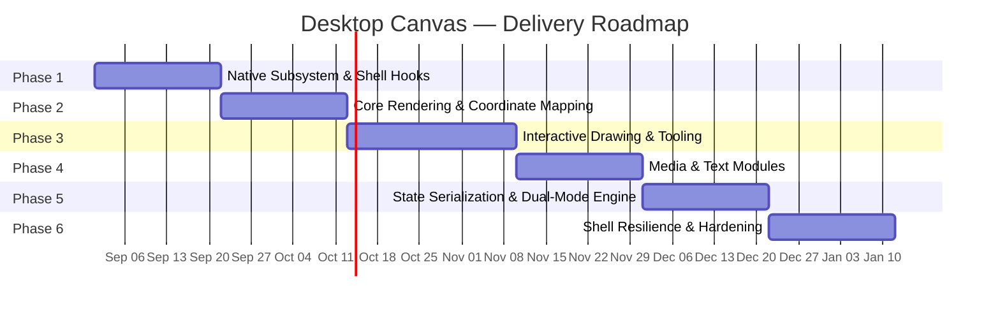

# Implementation Plan
## Desktop Canvas — Phase-by-Phase Development Roadmap

| Field | Value |
|---|---|
| Document | IMPLEMENTATION_PLAN.md |
| Version | 1.0.0 |
| Status | Draft — Ready for Engineering Planning |
| Related Docs | All prior documents in this suite |

---

## 1. Roadmap Overview

Total planned duration: **19 weeks** from kickoff to release-candidate freeze, exclusive of the stabilization buffer noted in §8.

## 2. Phase 1 — Native Subsystem & Shell Hooks (3 weeks)

**Objective:** Prove out the riskiest, least-documented part of the system first — the WorkerW desktop integration — before any UI investment.

| Task | Deliverable |
|---|---|
| Scaffold Tauri 2.0 project, Rust shell skeleton | Buildable, signed empty-window app |
| Implement WorkerW location algorithm (`WINDOW_MANAGEMENT_SPEC.md` §2) behind `WindowEnumerationSource` trait | Passing mock-environment unit tests (`TESTING_AND_QA_PLAN.md` §2.2) |
| Implement `SetParent`/`SetWindowPos` reparenting + retry/backoff state machine | Manual `Win + D` persistence demo on real hardware |
| System tray icon + context menu skeleton | Tray present with mode-toggle stub (no real canvas yet) |
| Autostart registry key management (`HKCU\...\Run` entry, toggle from tray) | Verified survives reboot |

**Exit criteria:** A blank-content window reliably survives `Win + D` and Explorer restart on both Windows 10 and Windows 11 reference machines.

## 3. Phase 2 — Core Rendering & Coordinate Mapping (3 weeks)

| Task | Deliverable |
|---|---|
| Multi-monitor virtual canvas bounds computation | Correct sizing across 1–3 monitor test rigs |
| `PerMonitorV2` DPI awareness + `WM_DPICHANGED`/`WM_DISPLAYCHANGE` handling | Passing M5–M9 in `TESTING_AND_QA_PLAN.md` |
| Backdrop Engine v1 (solid + gradient; image backdrop stubbed) | Backdrop renders correctly behind icons |
| Setup Wizard (functional, unstyled) | End-to-end wizard produces a valid `settings.json` |
| WebView2 host embedding + first IPC round-trip | `get_settings`/`update_settings` working over Tauri IPC |

**Exit criteria:** Wallpaper Mode with a static solid/gradient backdrop is stable across the full DPI matrix (M5–M8).

## 4. Phase 3 — Interactive Drawing & Tooling (4 weeks)

| Task | Deliverable |
|---|---|
| Pointer Events capture pipeline (pressure/tilt) | Raw stroke capture verified on pen hardware |
| Catmull-Rom → Bézier smoothing pipeline | Visually smooth strokes at all draw speeds |
| Pen / Highlighter / Eraser tools, blend modes | Feature-complete per `PRD.md` §7.2 |
| Floating HUD (Paint-3D-inspired), draggable/dockable | Matches `UI_UX_DESIGN.md` §4 spec |
| Popover panels (brush palette, opacity/width sliders) | Matches `UI_UX_DESIGN.md` §4.2 |

**Exit criteria:** Edit Mode sustains 60 FPS / < 16 ms input latency during continuous free-hand drawing on the reference hardware matrix.

## 5. Phase 4 — Media & Text Modules (3 weeks)

| Task | Deliverable |
|---|---|
| Clipboard listener (`Ctrl+V`) + drag-and-drop ingestion | Passing M10 (large image import) |
| SHA-256 asset hashing + dedup pipeline (`BACKEND_SCHEMA.md` §3) | Passing `test_asset_dedup_by_hash` |
| Free-transform gizmo (8-point resize, rotation, z-order) | Matches `UI_UX_DESIGN.md` §5 |
| Floating Text Notes (double-click creation, typography controls, sticky styling) | Feature-complete per `PRD.md` §7.4 |
| Image backdrop mode (fit modes: cover/contain/tile/center) | Backdrop Engine feature-complete |

**Exit criteria:** All four core content types (stroke, image, text note, backdrop) can be created, transformed, and layered together in a single session without data loss on save/reload.

## 6. Phase 5 — State Serialization & Dual-Mode Engine (3 weeks)

| Task | Deliverable |
|---|---|
| Full `CanvasStateSchema` persistence + debounced autosave | Passing §2.1 serialization test suite |
| Rolling backup writer (§1/§6 of `BACKEND_SCHEMA.md`) | 5-deep rolling backups verified |
| Render Loop Throttling Engine (suspend/resume, extended-idle unload) | Passing M15 (idle power draw) |
| `SetProcessWorkingSetSize` trimming integration | RAM budget (`PERFORMANCE_AND_LIFECYCLE_SPEC.md` §1) met in Wallpaper Mode |
| Full mode-transition animation + input-handover atomicity | < 150 ms visual transition, zero dropped input events under M16 (rapid toggling) |

**Exit criteria:** All performance budgets in `PERFORMANCE_AND_LIFECYCLE_SPEC.md` §1 are met simultaneously in a single continuous session covering both modes.

## 7. Phase 6 — Shell Resilience & Hardening (3 weeks)

| Task | Deliverable |
|---|---|
| `TaskbarCreated` hook + full re-injection pipeline (`WINDOW_MANAGEMENT_SPEC.md` §4) | Passing M11–M13 |
| Corrupted-state self-healing pipeline (`PERFORMANCE_AND_LIFECYCLE_SPEC.md` §4.1) | Passing M18 |
| Thread-deadlock detection/retry on the State I/O channel | Passing targeted fault-injection tests |
| Installer (MSI) with autostart opt-in, uninstall cleanup of `%APPDATA%\DesktopCanvas\` (with user confirmation) | Signed installer produced by CI |
| Full manual verification matrix pass (`TESTING_AND_QA_PLAN.md` §3) | Zero open P0/P1 defects |

**Exit criteria:** All release criteria in `TESTING_AND_QA_PLAN.md` §6 are met.

## 8. Stabilization Buffer

A **2-week** stabilization buffer follows Phase 6, not shown in the Gantt chart above, reserved exclusively for defects surfaced by the full manual matrix and any Windows-version-specific quirks discovered on hardware not available during earlier phases. This buffer is not planned work — it exists because `WINDOW_MANAGEMENT_SPEC.md` §5 explicitly documents that WorkerW behavior has varied across Windows 11 servicing updates, and schedule risk from that uncertainty should be made visible rather than absorbed silently into Phase 6.

## 9. Risk Register

| Risk | Likelihood | Impact | Mitigation |
|---|---|---|---|
| Undocumented WorkerW behavior changes in a future Windows 11 servicing update | Medium | High | Defensive enumeration algorithm (§5 of `WINDOW_MANAGEMENT_SPEC.md`) takes the first match rather than assuming exact cardinality; regression suite re-validates every release. |
| WebView2 runtime absent on a target machine | Low (pre-installed on supported Win10 21H2+/Win11) | Medium | Installer bundles the Evergreen Bootstrapper as a fallback dependency install step (`DEV_SETUP_AND_DEPENDENCIES.md` §3). |
| Pressure-sensitive pen input inconsistent across vendor drivers | Medium | Low | Pointer Events API abstracts vendor differences; graceful degradation to fixed-width strokes when `pressure` is unavailable (defaults to 0.5 per `BACKEND_SCHEMA.md` §2.2). |
| RAM budget slips once real content (large images) is loaded | Medium | Medium | M10 explicitly stress-tests 4K/8K imports; budget table in `PERFORMANCE_AND_LIFECYCLE_SPEC.md` §1 separates idle vs. loaded-content budgets so slippage is caught early, per-phase, rather than at the end. |
| Explorer-restart re-injection race condition | Medium | High | Exponential backoff retry policy (`WINDOW_MANAGEMENT_SPEC.md` §3.3) explicitly designed around this; covered by M11–M13. |

## 10. Milestones

| Milestone | Target | Gate |
|---|---|---|
| M1: Wallpaper survivability proven | End of Phase 1 | `Win + D` and basic Explorer-restart demo on real hardware |
| M2: Feature-complete Edit Mode | End of Phase 4 | All four content types functional |
| M3: Performance-budget-compliant build | End of Phase 5 | All budgets in `PERFORMANCE_AND_LIFECYCLE_SPEC.md` §1 met |
| M4: Release Candidate | End of Phase 6 | Zero P0/P1 defects, full matrix pass |
| M5: General Availability | End of stabilization buffer | Sign-off per `TESTING_AND_QA_PLAN.md` §6 |
