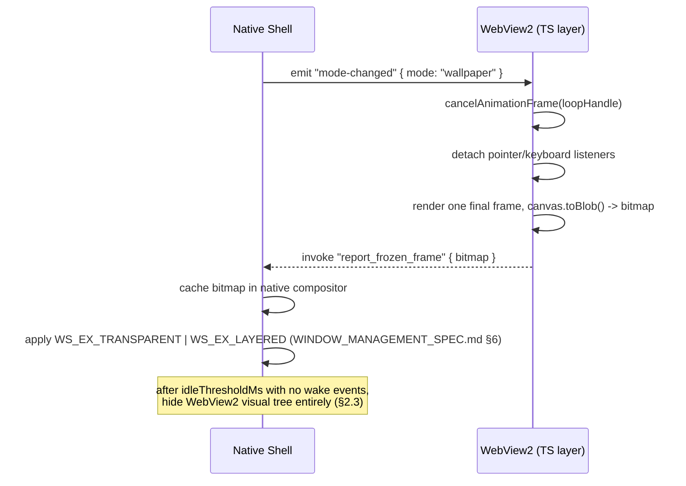
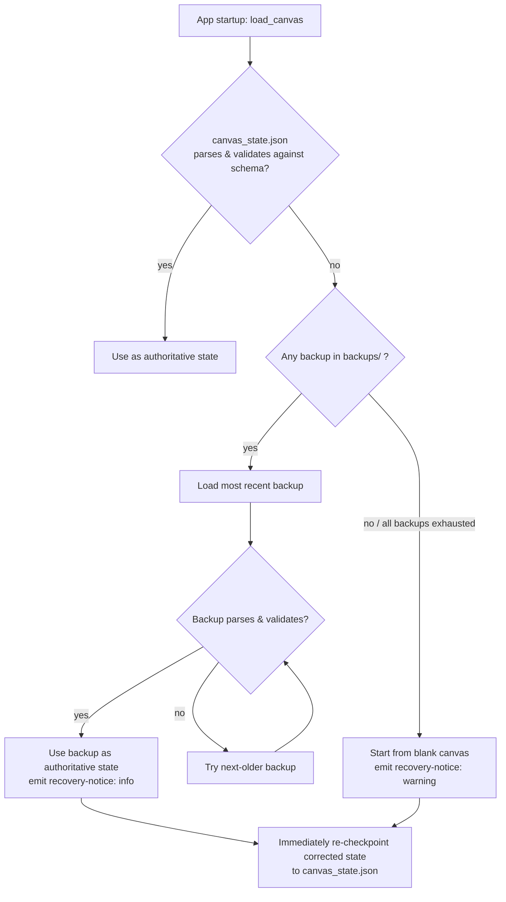
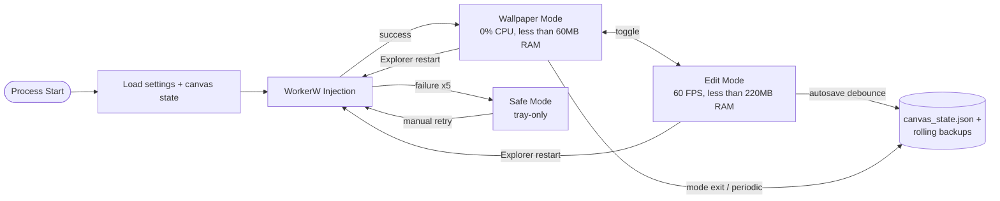

# Performance & Lifecycle Specification
## Desktop Canvas — Performance, Memory & Optimization Engine

| Field | Value |
|---|---|
| Document | PERFORMANCE_AND_LIFECYCLE_SPEC.md |
| Version | 1.0.0 |
| Status | Draft — Ready for Engineering Review |
| Related Docs | TRD.md, WINDOW_MANAGEMENT_SPEC.md, BACKEND_SCHEMA.md |

---

## 1. Performance Budgets

| Mode | CPU (sustained) | RAM (resident) | GPU draw calls | Frame rate | Input-to-render latency |
|---|---|---|---|---|---|
| Wallpaper Mode, idle | 0.0% | < 60 MB | 0 | N/A (static) | N/A |
| Wallpaper Mode, immediately after backdrop change | Brief spike, must return to 0.0% within 500 ms | < 60 MB steady-state | 1 (single re-composite) | N/A | N/A |
| Edit Mode, idle (no active input) | < 1.0% | < 140 MB | 0 (no redraw without invalidation) | N/A | N/A |
| Edit Mode, active drawing | Budget-permitting, no hard cap while user is actively drawing | < 220 MB with a 4K reference image loaded | As needed for 60 FPS | ≥ 60 FPS sustained | < 16 ms |

"0.0% CPU" in Wallpaper Mode is measured as **no sustained scheduler activity** for the process over a rolling 60-second sampling window using Windows Performance Recorder (WPR) traces — brief, sub-millisecond wake-ups for OS-level message pump servicing are expected and excluded from this measurement; a process that never yields the CPU at all is not achievable nor required.

## 2. Render Loop Throttling Engine

### 2.1 Suspension Sequence (entering Wallpaper Mode)



No `requestAnimationFrame` calls, DOM mutations, or Canvas2D redraws occur in Wallpaper Mode. The webview is not merely "not visible" — its script-driven render loop is explicitly cancelled, which is the difference between "occluded" (still costing CPU) and "suspended" (costing none).

### 2.2 Resumption Sequence (entering Edit Mode)

The reverse sequence restores listeners and resumes the `requestAnimationFrame` loop from the cached scene graph (not from the frozen bitmap — the bitmap is a purely visual cache; the authoritative content is always the in-memory scene graph plus the on-disk `canvas_state.json`, per `BACKEND_SCHEMA.md`).

### 2.3 Extended Idle: WebView Visual-Tree Unloading

If Wallpaper Mode persists beyond a configurable `idleThresholdMs` (default 300,000 ms / 5 minutes) with no display or DPI change events, the shell additionally:

1. Hides the WebView2 window (`ShowWindow(webviewHwnd, SW_HIDE)`), stopping it from being composited at all by DWM.
2. Continues to display the cached raster bitmap via a lightweight native layered-window compositing path owned entirely by the Rust shell — no browser engine involvement.
3. On the next Edit Mode request, restores the WebView2 window (`ShowWindow(webviewHwnd, SW_SHOW)`) before resuming the render loop, so there is no visible flash between "native raster" and "live webview" representations of the same content.

### 2.4 Garbage Collection & Working-Set Trimming

Immediately after the suspension sequence in §2.1 completes and the extended-idle unload in §2.3 (if applicable) has run:

```rust
use windows::Win32::System::Threading::GetCurrentProcess;
use windows::Win32::System::ProcessStatus::SetProcessWorkingSetSize;

unsafe {
    SetProcessWorkingSetSize(
        GetCurrentProcess(),
        usize::MAX, // (SIZE_T)-1: request OS-determined minimum
        usize::MAX,
    );
}
```

This is a **request**, not a guarantee — Windows may decline to trim aggressively under memory pressure elsewhere on the system, which is the correct and expected behavior; the call is issued opportunistically on every Wallpaper Mode entry, not relied upon as the sole mechanism for meeting the RAM budget in §1 (the budget must also be met through the suspension/unload mechanics in §2.1–2.3 on their own).

## 3. Backdrop-Change Fast Path

Changing the backdrop while already in Wallpaper Mode (e.g., a scheduled backdrop rotation, if enabled in a future release) does **not** require a full transition back through Edit Mode. The shell briefly re-shows a minimal, listener-free WebView2 instance solely to re-composite the new backdrop plus the existing frozen content layer into a fresh bitmap, then immediately re-enters the suspended state per §2.1/§2.3. This path is budgeted separately in §1's second row precisely because it is the one legitimate case where Wallpaper Mode briefly does non-zero work.

## 4. Failure Modes & Self-Healing

### 4.1 Corrupted State File Recovery



The corrupted file itself is never deleted — it is renamed to `canvas_state.corrupt.<timestamp>.json` under `backups\` for later diagnostics, so a QA or support investigation can always reconstruct what went wrong.

### 4.2 Thread Deadlock Detection

The native shell's main (Win32 message loop) thread and the State I/O thread (`TRD.md` §8) communicate exclusively via a bounded MPSC channel with a send timeout. If a `save_canvas` request does not receive an acknowledgment from the State I/O thread within **2000 ms**, the main thread:

1. Logs a `WARN`-level deadlock-suspicion event with the pending request's ID.
2. Does **not** block further UI interaction — the pending save is retried on a fresh channel handle rather than the UI thread waiting synchronously.
3. If three consecutive save attempts time out, the shell surfaces a `recovery-notice` (level: `warning`) to the user ("Your changes are queued but not yet saved to disk") rather than failing silently, while continuing to hold all unsaved state safely in memory.

### 4.3 WorkerW Injection Failure

Covered fully in `WINDOW_MANAGEMENT_SPEC.md` §3.3 (retry/backoff) and §3.2 (`SAFE_MODE` fallback). From a performance-and-lifecycle perspective, the key guarantee is that a failed injection never leaves the process in a state consuming Edit-Mode-level resources — `SAFE_MODE` is defined to be at least as cheap as Wallpaper Mode's idle budget in §1, since no canvas rendering occurs there at all.

## 5. Lifecycle Summary Diagram


