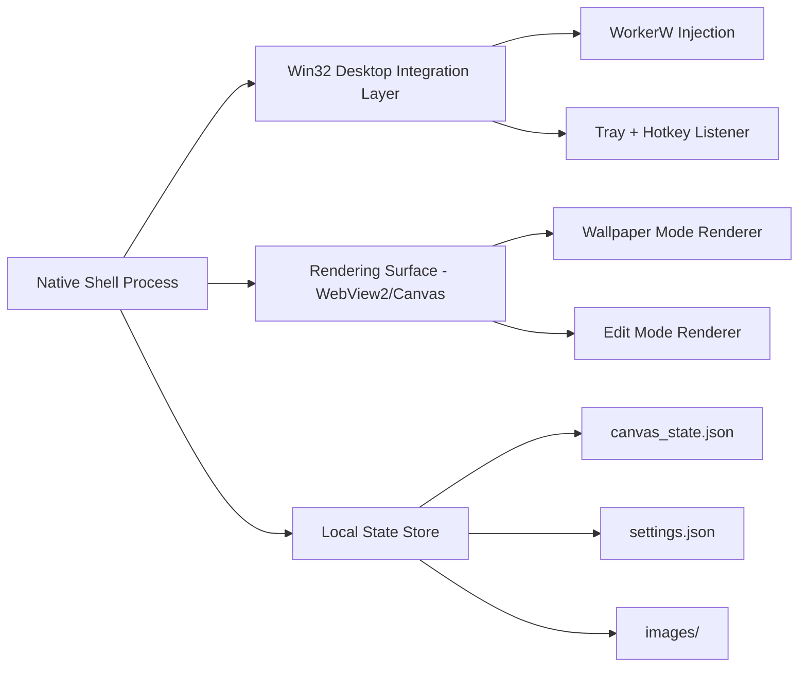

# Product Requirements Document (PRD)
## Desktop Canvas — A Dual-Personality Windows Desktop Application

| Field | Value |
|---|---|
| Document | PRD.md |
| Version | 1.0.0 |
| Status | Draft — Ready for Engineering Review |
| Owner | Product |
| Related Docs | TRD.md, WINDOW_MANAGEMENT_SPEC.md, UI_UX_DESIGN.md |

---

## 1. Executive Summary & Value Proposition

Desktop Canvas is a native Windows application that gives the desktop itself two lives. In its resting state, it is a **Wallpaper Engine**: a true, native background layer that sits behind desktop icons and beneath every open window, indistinguishable from a static wallpaper in terms of system cost. On demand, the same surface becomes an **Interactive Creative Workspace**: a full-bleed, Paint-3D-inspired canvas where the user can sketch, annotate screenshots, pin notes, and compose visual thoughts directly on their desktop.

The value proposition rests on three pillars:

1. **Zero-cost presence.** Unlike a floating whiteboard app or a browser tab, Desktop Canvas's "off" state (Wallpaper Mode) is not just hidden — it is architecturally inert. Rendering is suspended, not merely occluded, so the feature costs the user nothing until it is invoked.
2. **Zero-friction capture.** The desktop is the most-visited surface in a knowledge worker's day. Turning it into a scratchpad removes the "open an app, find a blank canvas, come back later" tax that kills spontaneous idea capture.
3. **Zero ambiguity about ownership.** Desktop Canvas never fights the user for control of their desktop. It does not intercept icon clicks, does not break `Win + D`, and does not appear in Alt-Tab while dormant. It behaves like wallpaper because, at the OS level, it *is* wallpaper.

## 2. Problem Statement

Knowledge workers, researchers, and visual thinkers routinely reach for disconnected tools to capture fleeting ideas: a sticky note app for text, a separate whiteboard app for sketches, Snipping Tool plus Paint for annotated screenshots, and a wallpaper changer for ambience. Each tool has its own window, its own save format, and its own context switch. None of them live *on* the desktop the way a literal whiteboard lives on an office wall. Desktop Canvas collapses these into a single, spatially-persistent surface that is always exactly where the user left it, without ever costing system resources while unused.

## 3. Goals & Non-Goals

**Goals**

- Provide a true wallpaper-layer rendering surface with near-zero idle resource cost.
- Provide a full-featured 2D drawing, annotation, and note-taking canvas, unlocked instantly from the same surface.
- Guarantee glitch-free, crash-proof transitions between the two modes.
- Persist all canvas state locally, per-user, with no cloud dependency.
- Support multi-monitor and multi-DPI configurations correctly out of the box.

**Non-Goals (v1)**

- No real-time multi-user collaboration or cloud sync.
- No mobile or cross-platform (macOS/Linux) support.
- No animated/video wallpaper engine (backdrop images and gradients only in v1; motion backdrops are a candidate for a future release).
- No plugin/extension marketplace in v1.
- No handwriting-to-text (OCR/ink recognition) in v1.

## 4. User Personas & Workflows

### 4.1 The Visual Thinker

**Profile:** Product designers, UX researchers, and strategists who think in diagrams, arrows, and spatial groupings rather than linear text.

**Daily workflow:** Opens the laptop, hits the Edit Mode hotkey before opening any application, and sketches the shape of the day's problem directly on the desktop — a rough flow, a box-and-arrow model, a list of open questions. Switches to Wallpaper Mode to work in other apps, glancing at the sketch in the background whenever a window is minimized. Returns to Edit Mode throughout the day to append new thoughts.

### 4.2 The Researcher

**Profile:** Analysts, students, and academics gathering and triaging evidence from many sources.

**Daily workflow:** Pastes screenshots of papers, charts, and web clippings directly onto the desktop canvas as they browse, arranging them spatially into evidence clusters using free transform and z-ordering. Adds typed text notes annotating each cluster with a working hypothesis. Because the canvas is the desktop, it survives being backgrounded for days without needing to be "found" again.

### 4.3 The Project Manager

**Profile:** Coordinators tracking many concurrent workstreams who need a persistent, glanceable overview.

**Daily workflow:** Uses the Backdrop Engine's grid overlay to lay out a lightweight kanban-style board using colored sticky notes (Floating Text Notes with custom background styling). Leaves the canvas in Wallpaper Mode during meetings — visible the instant all windows are minimized or `Win + D` is pressed — as a constant-attention-cost status radiator, then flips into Edit Mode to reprioritize between calls.

### 4.4 The Digital Artist

**Profile:** Illustrators and hobbyists sketching quick studies, mood boards, and reference compositions.

**Daily workflow:** Uses the Drawing & Inking Engine's pressure-sensitive Bézier stroke smoothing to rough out gesture studies. Imports reference images via drag-and-drop, uses free transform to build a mood board, and periodically exports or "bakes" the canvas as the new static wallpaper backdrop when a composition feels finished, clearing the working layer to start fresh.

## 5. Product Architecture Overview

Desktop Canvas is composed of three cooperating subsystems, detailed fully in `TRD.md` and `WINDOW_MANAGEMENT_SPEC.md`:

This document specifies **what** the product does; the mechanics of **how** are covered in the companion technical documents.

## 6. Core Mode Specifications

### 6.1 Wallpaper Engine Mode (Resting Desktop Layer)

Wallpaper Mode is the application's resting state where user creations seamlessly become the live desktop environment:

| Requirement | Specification |
|---|---|
| Native Background Binding | High-fidelity composite raster (combining backdrops, strokes, sticky notes, and placed media) is synchronized to the Windows desktop wallpaper (`SystemParametersInfoW(SPI_SETDESKWALLPAPER)`) and WorkerW surface. |
| Click-Through & Zero Dead Zones | All mouse and touch input passes through to desktop icons, files, and desktop context menu untouched. There are ZERO invisible click-blocking glass panes or trapped regions. |
| `Win + D` Structural Immunity | Pressing `Win + D` (Show Desktop) preserves canvas content cleanly. Because the surface is part of the true desktop wallpaper layer, it is structurally immune. |
| Multi-Monitor Alignment | Spans the full virtual desktop across all connected displays with accurate DPI and aspect-ratio scaling. |
| Resource Throttling | In Wallpaper Mode, all browser rendering loops and event listeners are suspended, yielding zero CPU utilization and minimal memory footprint. |

### 6.2 Edit Mode (Creative Studio & Desktop Overlay)

Edit Mode is the interactive state entered explicitly by the user to draw, take notes, and arrange content:

| Requirement | Specification |
|---|---|
| Immediate Visual Presence | Opens as a prominent, beautiful Fluent workspace or fullscreen interactive overlay. Never renders as an unstyled or invisible click-blocking box. |
| Activation | Triggered via global hotkeys (`Ctrl + Alt + D` or `F8`), system tray icon click, or Floating HUD button. |
| Interactive Canvas | Captures pen, mouse, and touch input for smooth Bézier drawing, sticky notes, and media transforms. |
| Escape Safety Net | Pressing `Escape` or clicking `⇄ Wallpaper` immediately dismisses the overlay and restores full normal desktop interactivity. |
| Floating HUD | Draggable, dockable modern toolbar with tool selection, color swatches, opacity sliders, and mode switcher. |
| Live Persistence | Automatically checkpoints scene graph state to disk (`canvas_state.json`) with debouncing and on transition. |

### 6.3 Transition Engine

| Requirement | Specification |
|---|---|
| Instantaneous Synchronization | Switching to Wallpaper Mode atomically exports a high-DPI canvas snapshot and updates the desktop layer in under 150 ms. |
| Crash-Proof Input Handover | Input focus is cleanly relinquished back to the Windows desktop. The overlay window is hidden or removed from the hit-test tree, guaranteeing desktop icons are instantly interactive. |
| Fault Tolerance | If any shell or display error occurs, Desktop Canvas gracefully falls back to the native desktop wallpaper without hanging or capturing mouse events. |

## 7. Detailed Feature Catalog

### 7.1 First-Time Setup Wizard / Launchpad

A four-step guided flow shown on first launch (and re-invocable from the tray menu as "Reconfigure Canvas"):

1. **Canvas geometry** — choose single continuous canvas across all monitors, or independent per-monitor canvases.
2. **Theme** — light/dark/auto (follows Windows theme) for the toolbar chrome; does not affect canvas backdrop.
3. **Backdrop selector** — solid color, gradient, or image, with live preview against the user's actual monitor arrangement.
4. **Session reload** — option to restore the previous canvas_state.json (if one exists from a prior install or profile) or start from a blank canvas.

Completing the wizard writes an initial `settings.json` and performs the first WorkerW injection.

### 7.2 Drawing & Inking Engine

- **Tools:** Pen (pressure- and tilt-aware where hardware supports it), Highlighter (fixed low-opacity flat cap), Eraser (stroke-level and pixel-level modes).
- **Stroke fidelity:** Raw input points are smoothed with a Catmull-Rom-to-Bézier conversion pipeline to eliminate jitter while preserving intentional sharp corners (via a curvature-threshold corner-detection pass).
- **Controls:** Width (1–64 px, slider + numeric entry), color (palette + custom hex/RGBA), opacity (0–100%), and per-tool last-used-setting memory.

### 7.3 Media Management

- **Ingestion:** `Ctrl+V` paste from clipboard (images and rendered HTML fragments), and drag-and-drop from Explorer or a browser.
- **Free transform:** Every placed image gets a bounding box with 8-point resize handles, a rotation handle, and corner-anchored proportional scaling (with a modifier key to allow free aspect-ratio distortion).
- **Z-ordering:** Bring to front / send to back / step forward / step backward, plus drag-based reordering in a layers list accessible from the HUD.

### 7.4 Floating Text Notes

- **Creation:** Double-click any empty canvas area to spawn a note in inline-edit state.
- **Typography controls:** Font family (curated system-font list), size, weight, and color, exposed in a compact popover.
- **Sticky-note styling:** Optional background fill and corner-radius presets so notes can visually read as sticky notes, index cards, or borderless floating text, per user preference.

### 7.5 Backdrop Engine

- **Solid:** Any hex/RGBA color.
- **Gradient:** Linear and radial, 2+ color stops, adjustable angle/focal point.
- **Image:** User-supplied image, with fit modes (cover, contain, tile, center).
- **Overlay:** Optional grid or dot overlay (adjustable spacing and opacity) rendered above the backdrop and below user content, useful for the Project Manager persona's kanban-style layouts.

### 7.6 System Tray & Desktop Controls

- **Tray icon:** Reflects current mode at a glance (distinct icon states for Wallpaper vs. Edit Mode; see `UI_UX_DESIGN.md` §6).
- **Context menu:** Toggle mode, open Setup Wizard, open canvas folder, pause autostart, quit.
- **Desktop HUD widget (optional, off by default):** A small, click-through status pill in a corner of the desktop showing current mode and a one-click mode toggle, for users who prefer not to memorize the hotkey.

## 8. Non-Functional Requirements

### 8.1 Performance

| Metric | Target |
|---|---|
| RAM usage, Wallpaper Mode | < 60 MB resident |
| CPU usage, Wallpaper Mode, idle | 0.0% (measured as no sustained scheduler activity over a 60s sampling window) |
| Frame rate, Edit Mode | ≥ 60 FPS sustained during active drawing |
| Input-to-render latency, Edit Mode | < 16 ms |
| Mode transition time | < 150 ms visual, < 1 frame functional handover |

Full budgets, measurement methodology, and enforcement mechanisms are specified in `PERFORMANCE_AND_LIFECYCLE_SPEC.md`.

### 8.2 Reliability

- Zero crashes attributable to mode toggling across the manual and automated test matrices in `TESTING_AND_QA_PLAN.md`.
- Graceful, automatic recovery when `explorer.exe` restarts or crashes, with no user-visible interruption beyond a sub-second re-injection delay.
- Corrupted or partially-written state files never prevent application startup; the app falls back to the last known-good snapshot (see `PERFORMANCE_AND_LIFECYCLE_SPEC.md` §4).

### 8.3 Security & Privacy

- 100% offline operation. No network calls are made by the core application in v1.
- All user content (strokes, images, notes, settings) is stored exclusively under the current Windows user's `%APPDATA%\DesktopCanvas\` directory — never in a shared or system-wide location.
- No telemetry is transmitted off-device. Any future opt-in diagnostics are out of scope for this document and would require a dedicated privacy addendum.

## 9. Success Metrics

| Metric | Target (90 days post-launch) |
|---|---|
| Median session length in Edit Mode | ≥ 3 minutes |
| Wallpaper Mode uptime as % of total app uptime | ≥ 80% (validates "resting state" adoption) |
| Crash-free session rate | ≥ 99.5% |
| Setup Wizard completion rate | ≥ 90% of first launches |
| Weekly-active-to-installed ratio | ≥ 40% at week 4 |

## 10. Release Criteria

A build is release-eligible only when:

1. All performance budgets in §8.1 are met on the reference hardware matrix in `TESTING_AND_QA_PLAN.md`.
2. The full manual verification matrix passes with zero P0/P1 defects open.
3. The Explorer-crash and `Win + D` stress tests each pass 100 consecutive iterations with zero failures.
4. Multi-DPI validation (100/125/150/200%) shows no visual misalignment on any tested configuration.

## 11. Glossary

| Term | Definition |
|---|---|
| WorkerW | An internal Windows worker window used by Progman/Explorer, exploited by wallpaper engines as a rendering host behind desktop icons. |
| Wallpaper Mode | The dormant, resource-frozen desktop-background state of Desktop Canvas. |
| Edit Mode | The active, interactive drawing/annotation state of Desktop Canvas. |
| Scene graph | The in-memory representation of all canvas elements (strokes, images, notes, backdrop) prior to serialization. |
| Backdrop | The base layer of the canvas (color, gradient, or image) beneath all user-authored content. |

## 12. Appendix: Related Documents

- `TRD.md` — technology stack and system architecture
- `WINDOW_MANAGEMENT_SPEC.md` — low-level Win32 desktop integration
- `UI_UX_DESIGN.md` — visual and interaction design system
- `BACKEND_SCHEMA.md` — state serialization and IPC contracts
- `PERFORMANCE_AND_LIFECYCLE_SPEC.md` — performance budgets and self-healing
- `TESTING_AND_QA_PLAN.md` — test strategy and verification matrix
- `IMPLEMENTATION_PLAN.md` — phased delivery roadmap
- `DEV_SETUP_AND_DEPENDENCIES.md` — developer environment setup
