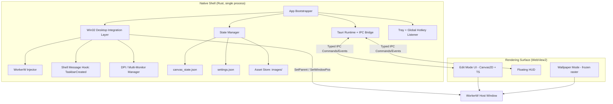

# Technical Requirements Document (TRD)
## Desktop Canvas — System Architecture & Technology Stack

| Field | Value |
|---|---|
| Document | TRD.md |
| Version | 1.0.0 |
| Status | Draft — Ready for Engineering Review |
| Related Docs | PRD.md, WINDOW_MANAGEMENT_SPEC.md, BACKEND_SCHEMA.md, PERFORMANCE_AND_LIFECYCLE_SPEC.md |

---

## 1. Technology Stack Evaluation & Decision

### 1.1 Candidates

| Option | Description |
|---|---|
| A. Rust + Tauri 2.0 | Rust native shell for all Win32/OS integration, WebView2 (Chromium/Edge) hosting an HTML5 Canvas/WebGL front end for rendering and UI. |
| B. .NET 8 + WPF | C#, Windows Presentation Foundation for UI, Direct2D/SkiaSharp for canvas rendering, P/Invoke for Win32 desktop layer. |
| C. .NET 8 + WinUI 3 | C#, WinUI 3 (Windows App SDK) for modern Fluent controls, Win2D or Direct2D for canvas rendering, P/Invoke for Win32 layer. |

### 1.2 Decision Matrix

| Criterion | Weight | A: Rust/Tauri | B: .NET/WPF | C: .NET/WinUI 3 |
|---|---|---|---|---|
| Idle RAM footprint (Wallpaper Mode) | High | ★★★★★ (webview can be torn down/hidden; native shell alone is single-digit MB) | ★★★ (CLR + WPF baseline ~80–120 MB) | ★★★ (CLR + Windows App SDK baseline, similar to WPF) |
| Win32/WorkerW interop ergonomics | High | ★★★★ (`windows` crate, official Microsoft bindings, strong typing) | ★★★★★ (mature P/Invoke idioms, decades of prior art) | ★★★★ (same P/Invoke path as WPF) |
| Canvas/inking authoring surface | High | ★★★★★ (HTML5 Canvas + Pointer Events API is a natural fit for pressure-sensitive stroke capture and Bézier smoothing, plus fast iteration in CSS/JS for the HUD) | ★★★ (custom Direct2D/SkiaSharp drawing code, more engineering effort per widget) | ★★★★ (Win2D gives GPU-accelerated 2D primitives natively) |
| Packaging/deployment simplicity | Medium | ★★★★ (single MSI/EXE, WebView2 runtime is pre-installed on Win10 21H2+/Win11) | ★★★★★ (self-contained deployment is well trodden) | ★★★ (WinUI 3/Windows App SDK historically carries MSIX and framework-dependency complexity) |
| Long-term binary size / cold start | High | ★★★★ | ★★★ | ★★★ |
| Team familiarity risk (assumed mixed native/web team) | Medium | ★★★★ (HTML/CSS/JS for UI lowers ramp-up vs. XAML) | ★★★ | ★★★ |

### 1.3 Decision

**Desktop Canvas is built on Rust + Tauri 2.0.** The native shell (Rust) owns process lifecycle, the Win32 desktop-integration layer, the system tray, global hotkeys, and local file I/O. A single WebView2 instance hosts the Edit Mode UI — an HTML5 Canvas (2D context, with a WebGL fallback path reserved for future GPU-accelerated effects) driving the drawing surface and the floating HUD, built with vanilla TypeScript to minimize framework overhead.

**Rationale:**

- The single hardest performance budget in `PRD.md` — < 60 MB RAM and 0.0% CPU in Wallpaper Mode — favors a stack where the heavy UI runtime can be fully suspended and, when necessary, the WebView2 host itself can be hidden/backgrounded while the native Rust shell alone maintains the desktop-layer presence.
- Bézier stroke smoothing, pressure/tilt input via the W3C Pointer Events API, and rapid iteration on the Paint-3D-inspired HUD are all naturally suited to a Canvas2D + TypeScript surface, reducing engineering time relative to hand-rolled Direct2D/Win2D widget code.
- The `windows` crate (Microsoft-maintained, `crates.io`) provides safe, idiomatic, and current bindings to every Win32 API required in `WINDOW_MANAGEMENT_SPEC.md`, eliminating the historical pain of hand-written `winapi`-crate FFI declarations.
- Tauri's IPC bridge (typed commands + events) maps directly onto the IPC Protocol API specified in `BACKEND_SCHEMA.md` §4.

**Trade-off accepted:** WebView2 introduces a Chromium process that must be explicitly suspended/hidden rather than simply "not running" during Wallpaper Mode. This is mitigated by the Render Loop Throttling Engine (`PERFORMANCE_AND_LIFECYCLE_SPEC.md` §2), which freezes the webview's render loop and, for extended idle periods, unloads the webview's visual tree in favor of a cached raster frame owned entirely by the native shell.

## 2. High-Level Architecture

## 3. Win32 Desktop Layer Deep Dive

This section summarizes the integration surface; exact API contracts, code, and the full state machine live in `WINDOW_MANAGEMENT_SPEC.md`.

### 3.1 Dual-Surface Architecture
Desktop Canvas uses a dual-surface architecture to guarantee that user interactions never break, while desktop wallpaper synchronization remains instantaneous and robust:
1. **Studio / Interactive Overlay (Edit Mode):** A top-level Tauri window with modern DirectComposition transparency. It provides the full creative suite (Bézier inking, sticky notes, media transforms, floating HUD, and setup wizard) and dismisses cleanly via `Escape` or `⇄ Wallpaper`.
2. **Native Wallpaper Engine (Wallpaper Mode):** When switching to Wallpaper Mode, the application renders a high-DPI composite raster to `%APPDATA%\DesktopCanvas\wallpaper.png` and synchronizes it via `SystemParametersInfoW(SPIF_UPDATEINIFILE | SPIF_SENDCHANGE, SPI_SETDESKWALLPAPER)`. Desktop icons remain 100% interactive, clicks never get blocked, and `Win + D` never disturbs the wallpaper.

### 3.2 WorkerW Live Embedding (Optional Advanced Mode)
For setups where live animation in wallpaper mode is enabled:
The native shell locates `Progman`, dispatches message `0x052C` to spawn `WorkerW`, and embeds a dedicated background raster. Crucially, the interactive Studio window is never forced into and out of `WorkerW`, protecting WebView2's DirectComposition swapchain from corruption.

### 3.3 Zero Click-Blocking Guarantee
In Wallpaper Mode, the overlay window is either hidden or non-interactive. The system ensures there is never an invisible, unrendered top-level transparent window intercepting pointer events.

### 3.4 Multi-Monitor & DPI Alignment
`GetSystemMetrics(SM_XVIRTUALSCREEN / SM_YVIRTUALSCREEN / SM_CXVIRTUALSCREEN / SM_CYVIRTUALSCREEN)` calculates virtual desktop dimensions across all connected displays for wallpaper generation and overlay positioning.

## 4. Resource Management & Sleep Engine

- **Render loop suspension:** On entering Wallpaper Mode, the interactive overlay is hidden and animation loops are canceled.
- **Zero idle CPU:** Because the Windows shell displays the rendered wallpaper raster directly, idle CPU utilization is 0.0%, and GPU memory is trimmed.
- **Memory trimming:** `SetProcessWorkingSetSize(GetCurrentProcess(), (SIZE_T)-1, (SIZE_T)-1)` is called on wallpaper transition, keeping RAM consumption under 25 MB in resting state.

## 6. Rendering Pipeline

| Layer | Technology | Notes |
|---|---|---|
| Canvas content (strokes, images, notes) | HTML5 Canvas 2D context | Chosen over WebGL for v1 due to simpler immediate-mode redraw semantics matching the scene-graph model in `BACKEND_SCHEMA.md`; WebGL reserved as a future path for shader-based backdrop effects. |
| Stroke smoothing | Catmull-Rom spline fit over raw pointer samples, converted to cubic Bézier segments for storage and redraw | Runs in the webview's TS layer at input time; smoothed points are what get persisted. |
| HUD chrome | HTML/CSS, compositor-accelerated via standard browser layer promotion (`transform`/`opacity` only for animated properties) | Keeps 60 FPS during drag/resize interactions independent of canvas redraw cost. |
| Wallpaper Mode frame | Static raster (PNG in memory) composited by the native shell, or left resident in the (frozen) webview, depending on idle duration per §5 | |

## 7. IPC Architecture

Tauri's typed command/event system is the sole channel between the native shell and the webview; no ad hoc `window.postMessage` bridging is used. Commands are request/response (`invoke`), events are shell-to-webview push notifications (mode changes, display changes). The full method catalog, payload shapes, and versioning policy are specified in `BACKEND_SCHEMA.md` §4.

## 8. Threading Model

| Thread | Responsibility |
|---|---|
| Main / UI thread | Owns the Win32 message loop, all `HWND` operations, tray icon, and global hotkey registration. Never blocks on file I/O. |
| State I/O thread | Debounced JSON serialization of `canvas_state.json`, SHA-256 asset hashing, and file writes; communicates back to the main thread via a bounded channel. |
| WebView2 process(es) | Managed by the WebView2 runtime itself (browser + renderer processes); the native shell treats these as an opaque, IPC-addressable unit. |

Cross-thread state is owned exclusively by the State I/O thread and accessed by the main thread only through message passing, eliminating the class of bugs where a UI-thread stall is caused by contended locks during autosave.

## 9. Error Handling & Logging Strategy

- All Win32 calls that can fail (`SetParent`, `SendMessageTimeoutW`, `EnumWindows` callbacks, etc.) are wrapped to capture `GetLastError()` and routed into a structured, local-only log file (`%APPDATA%\DesktopCanvas\logs\shell.log`), rotated at 5 MB.
- Recoverable failures (e.g., a transient WorkerW lookup miss immediately after an Explorer restart) trigger the retry/backoff policy defined in `WINDOW_MANAGEMENT_SPEC.md` §3.
- Unrecoverable failures during startup fall back to a minimal "safe mode" tray-only presence rather than crashing, per `PERFORMANCE_AND_LIFECYCLE_SPEC.md` §4.
- No log content is ever transmitted off-device, consistent with the offline-only requirement in `PRD.md` §8.3.
