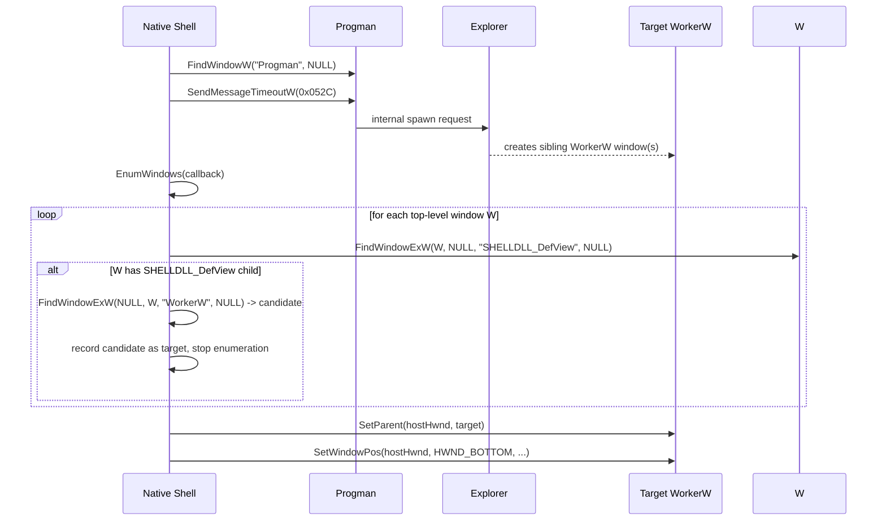
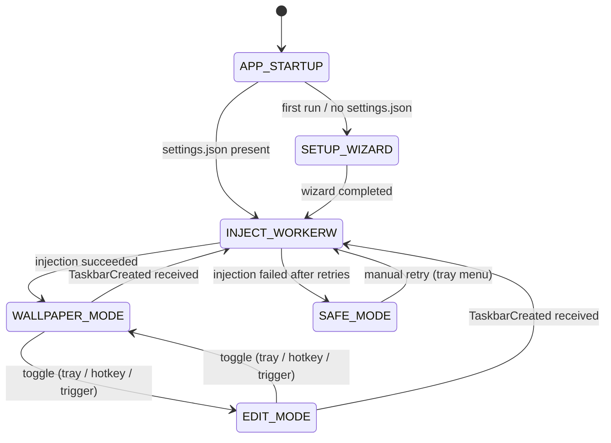
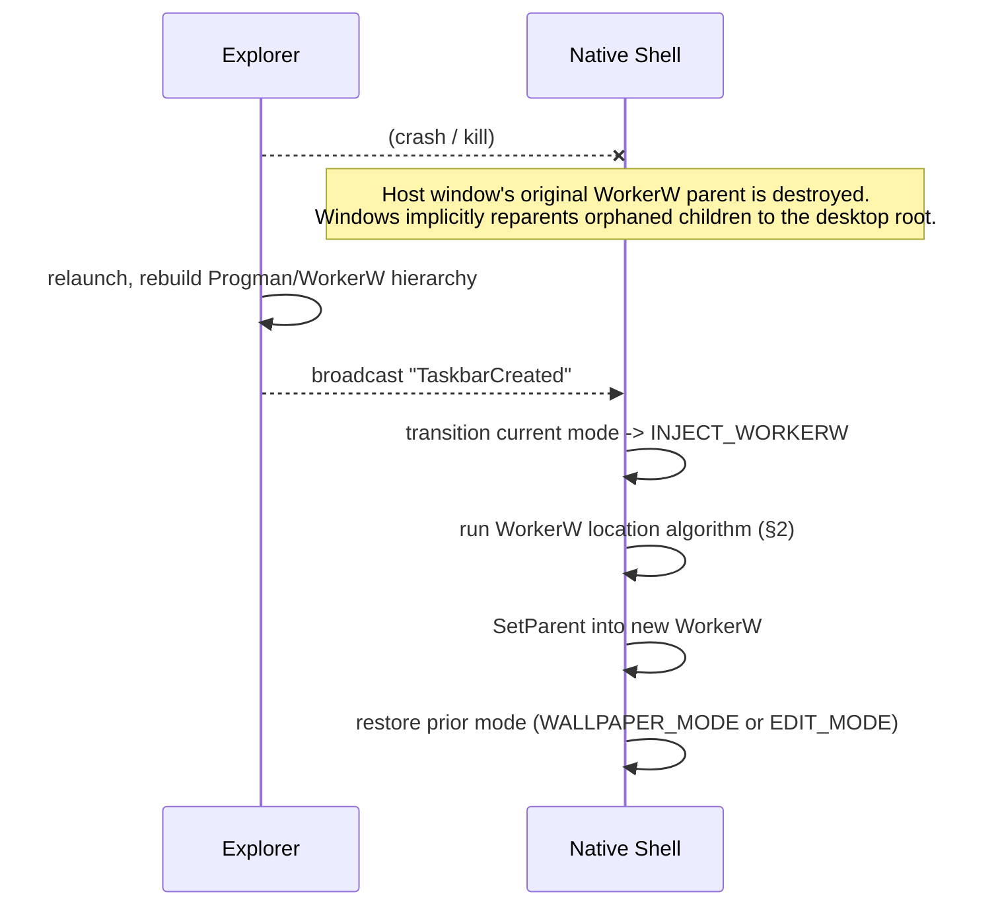

# Window Management Specification
## Desktop Canvas — Win32 Low-Level Desktop Integration

| Field | Value |
|---|---|
| Document | WINDOW_MANAGEMENT_SPEC.md |
| Version | 1.0.0 |
| Status | Draft — Ready for Engineering Review |
| Related Docs | TRD.md, PERFORMANCE_AND_LIFECYCLE_SPEC.md |
| Audience | Engineers implementing the native Rust shell's `desktop_integration` module |

---

## 1. Win32 API Contracts & Signatures

All calls below are made from Rust via the `windows` crate (`windows::Win32::UI::WindowsAndMessaging`, `windows::Win32::Foundation`). C-style signatures are given first for unambiguous reference, followed by the Rust call shape actually used in the shell.

### 1.1 `FindWindowW`

```c
HWND FindWindowW(
  [in, optional] LPCWSTR lpClassName,
  [in, optional] LPCWSTR lpWindowName
);
```

Used to locate the top-level `Progman` window by class name.

```rust
use windows::Win32::UI::WindowsAndMessaging::FindWindowW;
use windows::core::w;

let progman: HWND = unsafe { FindWindowW(w!("Progman"), None) }?;
```

### 1.2 `SendMessageTimeoutW`

```c
LRESULT SendMessageTimeoutW(
  [in]            HWND      hWnd,
  [in]            UINT      Msg,
  [in]            WPARAM    wParam,
  [in]            LPARAM    lParam,
  [in]            UINT      fuFlags,
  [in]            UINT      uTimeout,
  [out, optional] PDWORD_PTR lpdwResult
);
```

Dispatches the undocumented `0x052C` message to `Progman`, instructing it to spawn a `WorkerW`. `SendMessageTimeoutW` (not `SendMessageW`) is used deliberately: `Progman`'s handler for this message can, in rare cases, stall; the timeout guarantees the shell's UI thread is never blocked indefinitely.

```rust
const SPAWN_WORKERW: u32 = 0x052C;

unsafe {
    SendMessageTimeoutW(
        progman,
        SPAWN_WORKERW,
        WPARAM(0),
        LPARAM(0),
        SMTO_NORMAL,
        1000, // ms
        None,
    );
}
```

### 1.3 `EnumWindows`

```c
BOOL EnumWindows(
  [in] WNDENUMPROC lpEnumFunc,
  [in] LPARAM      lParam
);
```

Walks all top-level windows so the shell can identify which sibling of `Progman` is the target `WorkerW`. See §2 for the full enumeration algorithm.

### 1.4 `FindWindowExW`

```c
HWND FindWindowExW(
  [in, optional] HWND    hWndParent,
  [in, optional] HWND    hWndChildAfter,
  [in, optional] LPCWSTR lpszClass,
  [in, optional] LPCWSTR lpszWindow
);
```

Used inside the enumeration callback to test whether a given top-level window has a `SHELLDLL_DefView` child, and to walk to the next sibling `WorkerW`.

### 1.5 `SetParent`

```c
HWND SetParent(
  [in]           HWND hWndChild,
  [in, optional] HWND hWndNewParent
);
```

Reparents the Tauri host window into the target `WorkerW`. Returns the previous parent on success, `NULL` on failure (check `GetLastError`).

### 1.6 `SetWindowPos`

```c
BOOL SetWindowPos(
  [in]           HWND hWnd,
  [in, optional] HWND hWndInsertAfter,
  [in]           int  X,
  [in]           int  Y,
  [in]           int  cx,
  [in]           int  cy,
  [in]           UINT uFlags
);
```

Used with `hWndInsertAfter = HWND_BOTTOM` to pin the reparented window beneath any siblings, and separately (without a Z-order change) to size the window to the current virtual screen bounds.

### 1.7 `SetWindowLongPtrW`

```c
LONG_PTR SetWindowLongPtrW(
  [in] HWND hWnd,
  [in] int  nIndex,
  [in] LONG_PTR dwNewLong
);
```

Used with `nIndex = GWL_EXSTYLE` to toggle `WS_EX_TRANSPARENT | WS_EX_LAYERED` on and off for Wallpaper Mode click-through and Edit Mode input capture, respectively.

### 1.8 `RegisterWindowMessageW`

```c
UINT RegisterWindowMessageW(
  [in] LPCWSTR lpString
);
```

Registers the well-known `"TaskbarCreated"` message so the shell can detect Explorer restarts. See §4.

---

## 2. WorkerW Location Algorithm



**Enumeration callback pseudocode (production code is the Rust equivalent, no shortcuts):**

```rust
unsafe extern "system" fn enum_windows_proc(hwnd: HWND, lparam: LPARAM) -> BOOL {
    let state = &mut *(lparam.0 as *mut WorkerWSearchState);

    let shell_view = FindWindowExW(hwnd, None, w!("SHELLDLL_DefView"), None);
    if shell_view.0 != 0 {
        // This top-level window hosts the icon layer.
        // The WorkerW we want is the *next sibling* WorkerW after this one,
        // found by searching from NULL parent using hwnd as the "child after" cursor.
        let candidate = FindWindowExW(None, hwnd, w!("WorkerW"), None);
        if candidate.0 != 0 {
            state.target = Some(candidate);
            return BOOL(0); // stop enumeration
        }
    }
    BOOL(1) // continue enumeration
}
```

The shell calls `EnumWindows(Some(enum_windows_proc), LPARAM(&mut state as *mut _ as isize))` and, on completion, `state.target` holds the `WorkerW` to reparent into. If `state.target` is `None`, the retry policy in §3.3 applies.

---

## 3. State Machine & Lifecycle

### 3.1 State Diagram



### 3.2 State Definitions

| State | Description | Entry Actions |
|---|---|---|
| `APP_STARTUP` | Process launched, mutex checked. | Load `settings.json` if present; initialize logging; register single instance lock. |
| `SETUP_WIZARD` | First-run configuration flow (see `PRD.md` §7.1). | Show wizard webview as a normal top-level window so the user has immediate visual feedback. |
| `WALLPAPER_MODE` | Resting desktop state. | Hide overlay window; sync canvas raster to Windows desktop wallpaper (`SPI_SETDESKWALLPAPER`); zero idle CPU/RAM. |
| `EDIT_MODE` | Interactive creative session. | Show topmost overlay with visible Floating HUD; capture inking/notes input; wire `Escape` key to return to Wallpaper Mode. |
| `SAFE_MODE` | Degraded fallback if shell API fails. | Keep tray icon alive; fall back to standard desktop wallpaper; desktop icons remain fully interactive. |

### 3.3 Retry & Backoff Policy for `INJECT_WORKERW`

Injection can transiently fail immediately after `explorer.exe` (re)starts, because `Progman` may not yet have finished constructing its `WorkerW` hierarchy. The shell retries with exponential backoff:

| Attempt | Delay before attempt |
|---|---|
| 1 | 0 ms (immediate) |
| 2 | 150 ms |
| 3 | 400 ms |
| 4 | 1000 ms |
| 5 (final) | 2500 ms |

If all five attempts fail to yield a non-null `WorkerW` target, the shell transitions to `SAFE_MODE` and logs the failure (see `TRD.md` §9) rather than retrying indefinitely or crashing.

---

## 4. Explorer.exe Crash & Shell Restart Hooking

### 4.1 `TaskbarCreated` Registration

On startup, before entering `INJECT_WORKERW` for the first time, the shell registers the well-known broadcast message:

```rust
let taskbar_created: u32 = unsafe { RegisterWindowMessageW(w!("TaskbarCreated")) };
```

The value returned is cached and compared against `msg` in the shell's main `WndProc`. When Explorer restarts (crash-recovery, manual `taskkill /f /im explorer.exe` followed by relaunch, or a user-initiated Explorer restart from Task Manager), Windows broadcasts this message to all top-level windows, including the shell's own (currently-reparented, but still message-addressable) host window.

### 4.2 Teardown & Re-Injection Pipeline



Key implementation notes:

- The shell records which mode (`WALLPAPER_MODE` vs. `EDIT_MODE`) was active immediately before the `TaskbarCreated` signal and restores that same mode after successful re-injection, so an Explorer crash during active drawing does not silently dump the user into Wallpaper Mode.
- Any strokes/notes/images already committed to the in-memory scene graph are untouched by this pipeline — only the native `HWND` parenting relationship is rebuilt. No canvas content is lost.
- If re-injection fails (per the retry policy in §3.3) after an Explorer restart, the shell enters `SAFE_MODE` and the canvas content remains safely persisted on disk per `BACKEND_SCHEMA.md`, recoverable on the next successful injection.

---

## 5. Windows Version Quirks Matrix

| Behavior | Windows 10 (all supported builds) | Windows 11 |
|---|---|---|
| `WorkerW` count after `0x052C` | Reliably one new `WorkerW` sibling is created alongside the one already hosting `SHELLDLL_DefView`. | Some builds have been observed creating an additional `WorkerW` beyond the single expected sibling. The shell's enumeration (§2) must not assume exactly one match and should take the **first** `WorkerW` found immediately following the `SHELLDLL_DefView`-hosting window, ignoring any further siblings. |
| Icon layer window class | `SHELLDLL_DefView` hosted directly under a `WorkerW` under `Progman`. | Same hierarchy; class names unchanged as of the versions validated in `TESTING_AND_QA_PLAN.md`. |
| `TaskbarCreated` timing relative to `WorkerW` readiness | `WorkerW` hierarchy is consistently ready by the time `TaskbarCreated` fires. | Occasionally the hierarchy is not yet fully settled at the instant `TaskbarCreated` fires; the retry/backoff policy in §3.3 is the mitigation and must not be skipped "for speed" on Windows 11 specifically. |
| Multiple desktops (Task View virtual desktops) | `WorkerW` injection is desktop-agnostic; the canvas appears on the primary desktop's icon layer only, by design (v1 does not support per-virtual-desktop canvases). | Same. |

**Engineering guidance:** Because exact `WorkerW` cardinality has varied across Windows 11 servicing updates and is not documented by Microsoft, the enumeration algorithm in §2 is written to be robust to either one or multiple candidate `WorkerW` siblings by always taking the first match immediately following the icon-hosting window, and this behavior must be re-validated against the current Windows 11 servicing branch as part of every release cycle's manual test pass (`TESTING_AND_QA_PLAN.md` §2).

---

## 6. Transparent Hit-Testing for Wallpaper Mode Click-Through

Two complementary mechanisms are used together, not as alternatives:

1. **Extended window style (primary mechanism):**

   ```rust
   use windows::Win32::UI::WindowsAndMessaging::{
       SetWindowLongPtrW, GWL_EXSTYLE, WS_EX_TRANSPARENT, WS_EX_LAYERED,
   };

   unsafe {
       let ex_style = GetWindowLongPtrW(host_hwnd, GWL_EXSTYLE);
       SetWindowLongPtrW(
           host_hwnd,
           GWL_EXSTYLE,
           ex_style | (WS_EX_TRANSPARENT.0 as isize) | (WS_EX_LAYERED.0 as isize),
       );
   }
   ```

   `WS_EX_LAYERED` is required as a co-requisite for `WS_EX_TRANSPARENT` to take effect reliably for hit-testing purposes on a window that also renders content (it also enables the frozen-raster compositing path described in `TRD.md` §5).

2. **`WM_NCHITTEST` interception (defense in depth):** The shell's `WndProc` explicitly returns `HTTRANSPARENT` for this message while in `WALLPAPER_MODE`, guarding against any compositor-level caching of hit-test results across the extended-style toggle:

   ```rust
   WM_NCHITTEST if current_mode == Mode::Wallpaper => {
       LRESULT(HTTRANSPARENT as isize)
   }
   ```

On transition into `EDIT_MODE`, both the extended style is cleared and the `WM_NCHITTEST` override is disabled, restoring normal hit-testing so the canvas can capture pointer input.
